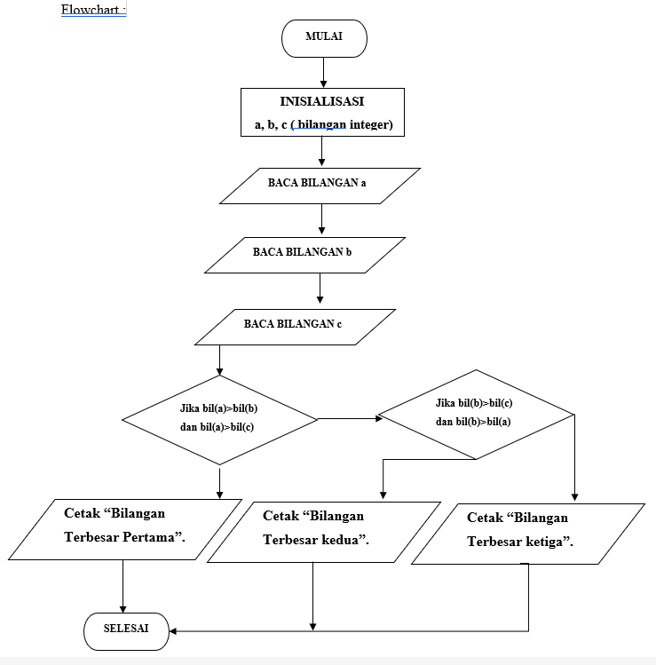
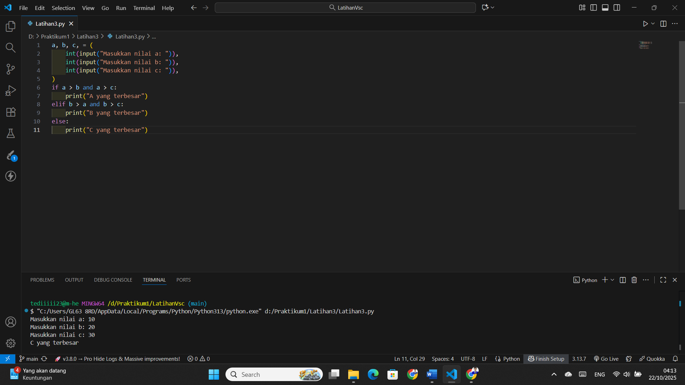

# NAMA  : TEDI MULYADI
# NIM   : 312110114
# KELAS : TI.21.C.1
# TUGAS : BAHASA PEMROGRAMAN  

### Latihan 3

• Buat flowchart untuk menentukan bilangan terbesar
dari 3 buah bilangan yang diinputkan?  

### flowchart

  

### deklarasi

1.	mulai  

2.	inisialisasi bilangan a, b, c sebagai integer  

3.	baca input a  

4.	baca input b  

5.	baca input c  

6.	Jika bilangan a  >  bilangan b dan bilangan a > bilangan c maka Cetak “Bilangan Terbesar Pertama”.  

7.	selain itu  

8.	Jika bilangan b > bilangan a dan bilangan b > bilangan c maka Cetak “Bilangan Terbesar Kedua”.  

9.	selain itu Cetak “Bilangan Terbesar Ketiga”.  

10.	Selesai  

### hasil dari program python  

  

• Buat flowchart untuk menentukan bilangan terbesar
dari N bilangan yang diinputkan, untuk menentukan
jumlah N, berikan masukan angka 0.
